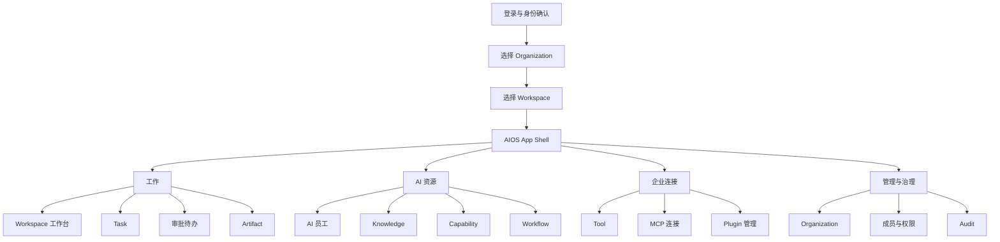
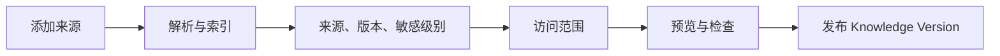
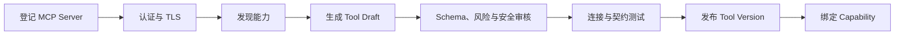
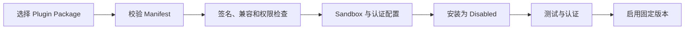
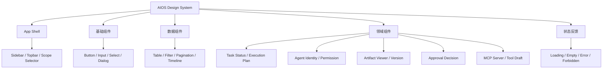

# AIOS 页面优先前端设计规格

> 规格状态：已批准
> 批准日期：2026-07-25
> 交付方式：可运行 Next.js 前端，使用类型化 Mock 数据完成页面与交互
> 架构依据：`README.md`、`docs/01-PRD.md`、`docs/02-ARCHITECTURE.md`、`docs/03-TECH_STACK.md`、`docs/07-AGENT_ENGINE.md` 至 `docs/12-PLUGIN_SDK.md`

## 1. 设计目的

本规格定义 AIOS 第一阶段页面实现方式。当前阶段先建立可运行、可导航、可交互、可测试的企业级前端，通过 Mock 数据呈现完整产品结构，不接入真实后端、模型、数据库、向量库或外部企业系统。

页面必须回答四个问题：

1. 企业用户当前位于哪个 Organization 和 Workspace；
2. 哪个 Task 正在由哪个 AI 员工执行，当前责任主体是谁；
3. Knowledge、Capability、Workflow、Tool、MCP 和 Plugin 如何受控配置；
4. Task 最终产生了什么 Artifact，谁完成了审批、验收和 Audit。

本阶段不是静态图片或不可操作的原型。交付物必须能够本地启动，具备真实路由、交互、表单校验、筛选、分页、状态切换、版本查看以及加载、空白、错误、无权限等界面状态。

## 2. 不可变架构约束

页面实现严格服从 `README.md` 与已完成文档，不通过 UI 命名改变领域模型。

| 约束 | 页面实现规则 |
|---|---|
| AIOS 管理工作，不管理聊天 | 首页是 Workspace 工作台，不是聊天输入框 |
| Task 是核心工作单位 | 工作台、导航、详情和指标都围绕 Task 展开 |
| Agent 是 AI 员工 | 页面显示身份、岗位、人类责任人、Capability、权限和状态 |
| Agent 保持无状态 | 页面不把 Conversation 或浏览器 Session 表示为 Agent 长期状态 |
| Knowledge 独立管理 | Knowledge 有独立列表、详情、版本、范围和索引状态 |
| Everything is Capability | Prompt、Model Policy、Workflow、Knowledge 和 Tool 通过 Capability 组合 |
| Workflow 可配置 | Workflow 页面显示步骤、责任主体、审批、失败和返工路径 |
| Tool 受控调用 | Tool 页面显示 Action、风险、权限、版本和使用情况 |
| Everything produces Artifact | 终态 Task 必须关联 Artifact；工作台突出待验收成果 |
| Audit 贯穿全程 | 关键创建、配置、审批、发布、执行、验收和异常均有 Audit 展示 |
| API First | 页面状态与动作按明确契约建模，即使当前数据来自 Mock Provider |
| Modular Monolith | 前端按领域模块组织，禁止按页面复制业务状态与术语 |
| Plugin Architecture | Plugin 只能扩展已有模块，不能成为新的核心业务领域 |

## 3. 核心概念与页面归属

### 3.1 核心模块

| README 概念 | 页面归属 | 第一阶段页面能力 |
|---|---|---|
| Organization | 管理与治理 | 选择、概览、范围确认 |
| User | 成员与权限 | 身份、职责、成员状态、权限说明 |
| Agent | AI 员工 | 列表、详情、状态、责任人、授权关系 |
| Knowledge | AI 资源 | 来源、版本、索引、敏感级别、访问范围 |
| Capability | AI 资源 | 版本、Prompt、Model Policy、Knowledge、Workflow、Tool 绑定 |
| Workflow | AI 资源 | 受控流程、步骤、审批、失败、返工和版本 |
| Task | 工作 | 创建、列表、详情、计划、执行、协作和状态 |
| Tool | 企业连接 | Tool、Action、风险、权限、版本和调用情况 |
| Memory | 后续 P1 | 第一阶段不提供导航入口，不用临时页面替代 |
| Artifact | 工作 | 列表、详情、版本、证据、检查和验收 |
| Audit | 管理与治理 | 事件、主体、对象、动作、结果和关联范围 |

### 3.2 MCP 的归属

MCP 是 Tool Layer 的标准连接方式，不是与 Tool 平级的新核心领域。MCP Server 被登记后只能发现候选能力，发现结果必须转换为 Tool Draft，并经过 Schema、风险、Permission、安全和发布审核。

前端可以提供“MCP 连接”导航入口，但该入口属于“企业连接”页面分组。页面不得暗示：

- MCP Server 自动成为已发布 Tool；
- MCP Tool 描述自动获得 Permission；
- Agent 可以直接持有 MCP Credential；
- MCP 调用可以绕过 Task、Capability、Approval、Artifact 或 Audit。

### 3.3 Plugin 的归属

Plugin 是扩展机制，不是新的核心领域模块。“Plugin 管理”是平台配置页面，其资源最终回到既有模块：

| Plugin 扩展类型 | 归属模块 |
|---|---|
| Tool Plugin | Tool |
| MCP Adapter | Tool |
| Knowledge Source Plugin | Knowledge |
| Workflow Template | Workflow |
| Capability Template | Capability |
| Artifact Renderer | Artifact |

第一阶段只提供已安装 Plugin 的包、Manifest、版本、权限、Sandbox、认证、测试和启停视图，不实现 Marketplace 交易。

## 4. 信息架构



### 4.1 全局应用框架

应用框架由三部分组成：

1. 深色左侧导航：显示模块分组、当前页面、审批数量和折叠控制；
2. 顶部范围栏：显示并切换 Organization、Workspace，提供创建 Task、通知和当前用户入口；
3. 浅色内容区：承载页面标题、范围说明、主操作、筛选、数据和状态反馈。

Organization、Workspace 和当前用户职责必须在所有受保护页面保持可见。切换 Workspace 后，Task、Agent、Knowledge、Capability、Tool、Artifact、审批和 Audit 的 Mock 查询范围同步切换。

## 5. 路由规划

### 5.1 身份与范围

| 路由 | 页面 |
|---|---|
| `/login` | 登录与身份确认 |
| `/organizations` | Organization 选择 |
| `/workspaces` | Workspace 选择 |

### 5.2 工作

| 路由 | 页面 |
|---|---|
| `/workspace` | Workspace 工作台 |
| `/tasks` | Task Center |
| `/tasks/new` | 创建 Task |
| `/tasks/[taskId]` | Task 详情 |
| `/approvals` | 审批待办 |
| `/artifacts` | Artifact Center |
| `/artifacts/[artifactId]` | Artifact 详情 |

### 5.3 AI 资源

| 路由 | 页面 |
|---|---|
| `/agents` | AI 员工列表 |
| `/agents/[agentId]` | AI 员工详情 |
| `/knowledge` | Knowledge 列表 |
| `/knowledge/new` | 添加 Knowledge |
| `/knowledge/[knowledgeId]` | Knowledge 详情 |
| `/capabilities` | Capability 列表 |
| `/capabilities/[capabilityId]` | Capability 详情 |
| `/workflows` | Workflow 列表 |
| `/workflows/[workflowId]` | Workflow 详情与受控配置 |

### 5.4 企业连接

| 路由 | 页面 |
|---|---|
| `/tools` | Tool 列表 |
| `/tools/[toolId]` | Tool 详情 |
| `/tools/mcp` | MCP 连接列表 |
| `/tools/mcp/new` | 添加 MCP Server |
| `/tools/mcp/[serverId]` | MCP Server 详情 |
| `/plugins` | Plugin 管理 |
| `/plugins/[pluginId]` | Plugin 详情 |

### 5.5 管理与治理

| 路由 | 页面 |
|---|---|
| `/organization` | Organization 与 Workspace 概览 |
| `/members` | 成员与权限 |
| `/audit` | Audit Center |

## 6. 首批页面设计

### 6.1 登录与范围选择

登录页使用 Mock 身份切换模拟产品经理、开发工程师、研发负责人、Workspace Admin 和 Auditor。用户选择身份后进入 Organization 与 Workspace 选择流程。

范围选择页面必须显示：

- 名称、标识和用途；
- 当前用户职责；
- 可访问 Workspace 数量；
- 最近进入时间；
- 无权限和已归档状态；
- 进入按钮及不可进入原因。

### 6.2 Workspace 工作台

工作台在五秒内帮助用户识别：

- 当前工作范围；
- 我的待办；
- 进行中、等待人工、失败和完成的 Task；
- AI 研发员工状态；
- 待验收 Artifact；
- Tool、Knowledge 或 Agent 风险；
- 六类研发 Task 快捷入口。

工作台不展示通用聊天输入框。主操作为“创建 Task”。

### 6.3 Task Center 与创建 Task

Task Center 支持：

- 关键字搜索；
- 我的任务、我参与、待我审批、待我验收筛选；
- 状态、任务类型、Agent、风险和时间筛选；
- 表格与分页；
- 加载、空白、失败和无权限状态。

创建 Task 使用五步向导：

1. 选择六类研发任务模板；
2. 定义目标、问题、范围、优先级和不做事项；
3. 提供 Knowledge、材料、关联 Task 或 Artifact；
4. 定义 Artifact、检查、完成标准和验收人；
5. 选择 AI 研发员工并确认 Capability、Tool、Permission 和审批点。

第一条默认黄金路径使用“分析需求 → 代码影响分析 → 生成技术方案 Artifact”，只读风险为 R0/R1，不执行代码写入。

### 6.4 Task 详情

Task 详情包含以下标签：

- 概览；
- 计划；
- 执行；
- Artifact；
- 协作；
- Audit。

页头显示 Task 标识、状态、优先级、风险、Organization、Workspace、发起者、责任 Agent 和当前责任人。暂停、取消、补充信息、人工接管、批准、退回等动作必须使用明确名称，并在执行前说明影响。

### 6.5 审批待办

审批待办区分计划、动作和 Artifact 三类。列表显示 Task、Workspace、发起主体、风险、等待时长、截止时间和影响范围。

审批详情显示：

- 为什么需要审批；
- 准备执行什么；
- 使用哪些 Knowledge、Capability 和 Tool；
- 影响对象和可逆性；
- 当前完成标准；
- 相关证据；
- 批准、要求调整、驳回和转交动作。

审批页不能只显示 Agent 的自然语言结论而隐藏证据。

### 6.6 Artifact

Artifact Center 提供搜索、类型、状态、来源 Task、Agent、Capability 和时间筛选。

Artifact 详情显示：

- 名称、类型、版本和状态；
- 来源 Task、Agent 和 Capability；
- 完成标准与检查结果；
- Knowledge 引用；
- 版本变化；
- 验收决定与反馈；
- 允许的后续行为。

技术方案以章节化文档展示，至少包含需求理解、影响范围、受影响文件、技术决策、风险、测试建议和回退考虑。退回后创建新的 Artifact Version，历史版本保持只读。

### 6.7 AI 员工

列表显示 AI 员工身份、岗位、状态、人类责任人、自治等级、Workspace、进行中 Task、质量和异常。

AI 研发员工详情包含：

- 身份与岗位；
- 人类责任人；
- Organization 与 Workspace；
- Knowledge 授权；
- 已发布 Capability；
- 可使用 Tool；
- Permission 和自治等级；
- 当前版本与状态；
- 测试 Task；
- 进行中 Task；
- Artifact 采用与失败摘要；
- 最近 Audit。

页面不得把 Agent 表示为聊天机器人头像或人格化角色卡。

### 6.8 Knowledge

Knowledge 列表显示名称、类型、来源、所有者、Organization、Workspace、敏感等级、状态、当前版本、索引状态和引用情况。

添加 Knowledge 的交互流程：



Knowledge 详情提供内容预览、来源说明、适用范围、访问范围、版本历史、引用 Task、纠错、失效和恢复。Mock 交互需要模拟解析中、索引成功、部分失败和权限拒绝状态。

### 6.9 Capability 与 Workflow

Capability 详情包含：

- 能力目标和适用 Task；
- 输入要求和 Artifact Contract；
- Prompt Version；
- Model Policy Version；
- Knowledge、Tool 和 Workflow 绑定；
- Permission 和风险；
- 代表性样本与评测；
- 版本和发布状态。

Workflow 页面只能在受控模板内配置步骤顺序、责任主体、输入输出、条件、审批、失败、返工和结束条件。第一阶段不提供无限自由画布，不允许无界循环或删除强制审批点。

### 6.10 Tool、MCP 与 Plugin

Tool 列表显示 Tool、版本、Action、风险、状态、授权关系和最近调用。Tool 详情提供 Action Schema、Permission、审批要求、Capability 使用和 Audit。

MCP 配置流程：



MCP 页面必须显示 Server Identity、Transport、Credential 引用、TLS、Workspace 范围、固定版本、发现的 Tool Draft、风险和发布状态。明文 Secret 不得进入前端 Mock 数据。

Plugin 配置流程：



Plugin 详情显示包信息、Manifest、扩展类型、版本、Digest、Permission 上限、Sandbox、Authentication、兼容性、测试结果和 Audit。热更新不能替换正在运行 Task 固定的 Plugin Version。

### 6.11 Organization、成员与权限、Audit

Organization 页面显示企业边界、Workspace、负责人、成员摘要、AI 员工、Task 和风险概览。

成员与权限页面显示 User、职责、Organization/Workspace 范围、状态和最近变更。页面可以模拟职责分配与撤销，但必须阻止用户给自己授予超出当前授权的权限。

Audit Center 支持按主体、对象、动作、结果、风险、Workspace 和时间筛选。事件详情显示时间、Actor、职责、对象、动作、结果、关联 Task、Artifact、Capability、Tool 和审批信息。普通用户不能编辑或隐藏 Audit。

## 7. 视觉系统

### 7.1 色彩

| Token | 色值 | 用途 |
|---|---:|---|
| Navigation | `#0B1220` | 侧边栏 |
| Primary | `#4F46E5` | 主操作、选中状态 |
| AI Accent | `#0891B2` | AI 员工和连接状态 |
| Canvas | `#F5F7FB` | 页面背景 |
| Surface | `#FFFFFF` | 卡片、表格、表单 |
| Text Primary | `#172033` | 标题与正文 |
| Text Secondary | `#667085` | 描述与辅助文字 |
| Success | `#16803C` | 已完成、已启用、正常 |
| Warning | `#B54708` | 待审批、风险 |
| Error | `#C4320A` | 失败、拒绝、异常 |

状态必须同时使用文字、图标和颜色，不能仅依赖颜色。

### 7.2 排版与布局

- 中文字体：`Inter, PingFang SC, Microsoft YaHei, sans-serif`；
- 代码与标识：`JetBrains Mono, Consolas, monospace`；
- 基础字号 14px，页面标题 28px，卡片标题 16px；
- 展开侧边栏 248px，折叠侧边栏 72px；
- 顶部栏 64px；
- 内容间距 24px，宽屏使用 32px；
- 卡片圆角 10px，以边框为主、阴影为辅；
- 不使用玻璃拟态、强渐变、科幻 HUD 或营销 Hero。

### 7.3 组件体系



## 8. 前端实现结构

第一阶段遵循 `docs/03-TECH_STACK.md` 的前端基线：

- Next.js；
- React；
- TypeScript 严格模式；
- Tailwind CSS；
- shadcn/ui；
- Vitest；
- Testing Library；
- Playwright。

建议目录：

```text
frontend/
├── src/
│   ├── app/
│   ├── components/
│   │   ├── ui/
│   │   ├── layout/
│   │   └── domain/
│   ├── features/
│   │   ├── organization/
│   │   ├── user/
│   │   ├── agent/
│   │   ├── knowledge/
│   │   ├── capability/
│   │   ├── workflow/
│   │   ├── task/
│   │   ├── tool/
│   │   ├── artifact/
│   │   └── audit/
│   ├── mock/
│   ├── types/
│   └── styles/
├── tests/
└── public/
```

`Plugin` 页面可以位于企业连接路由中，但其数据类型必须表达对既有模块的扩展，不创建独立核心领域 Feature。MCP 数据放在 Tool Feature 内。

### 8.1 Mock 数据策略

- 所有 Mock 数据使用稳定标识和显式版本；
- 数据按 Organization 和 Workspace 隔离；
- 页面动作通过统一 Mock Provider 执行；
- Provider 返回成功、校验失败、无权限、冲突和系统错误；
- Mock 行为使用确定性延迟，便于测试加载状态；
- 不保存明文 Secret、Token、私钥或真实企业数据；
- 页面不直接在组件中散落业务状态字符串。

### 8.2 状态语言

Task、Agent、Knowledge、Capability、Workflow、Tool、Artifact、Plugin 和 MCP Server 使用各自已定义的生命周期。UI 只负责呈现允许的状态和动作，不在组件中创造新的领域状态。

## 9. 响应式与可访问性

- 桌面端为主要使用环境；
- 1280px 以上展示完整侧边栏和多列控制台；
- 768px 至 1279px 支持折叠侧边栏和重排卡片；
- 768px 以下侧边栏变为抽屉，表格切换为可读卡片或横向滚动；
- 所有交互支持键盘操作；
- 焦点样式始终可见；
- 普通文字对比度不低于 4.5:1；
- 表单字段具有可见 Label、说明和错误信息；
- 弹窗具备焦点锁定和关闭后焦点恢复；
- 动效尊重 `prefers-reduced-motion`；
- 图标按钮具有可访问名称。

## 10. 测试策略

### 10.1 组件测试

- 导航选中、折叠和权限显示；
- 状态 Badge 的文字与语义；
- 表单校验和错误提示；
- 表格筛选、排序和分页；
- Dialog、Tabs、Stepper、Timeline；
- Artifact 版本切换；
- MCP Tool Draft 审核状态；
- Plugin Manifest、Permission 和版本视图。

### 10.2 页面测试

- 每条规划路由可打开；
- 页面具备 Loading、Empty、Error 和 Forbidden 状态；
- Organization/Workspace 切换更新页面范围；
- 无权限身份看不到可执行动作；
- 刷新后保持当前 Mock 身份和工作范围；
- 不存在死链和空壳导航。

### 10.3 端到端测试

核心 E2E 场景：

1. 选择研发负责人身份并进入 Workspace；
2. 创建“生成技术方案”Task；
3. 查看 Task 计划与模拟执行；
4. 打开生成的 Artifact；
5. 退回并填写审核意见；
6. 查看新的 Artifact Version；
7. 验收通过；
8. 在 Audit 中查询完整事件。

配置 E2E 场景：

1. 添加 MCP Server；
2. 选择 Credential 引用并完成连接测试；
3. 发现 Tool Draft；
4. 审核 R0 只读 Action；
5. 发布 Tool Version；
6. 在 Capability 详情中查看绑定；
7. 在 Audit 中查看登记、审核和发布事件。

## 11. 第一阶段明确不做

- 真实后端接口；
- 真实模型调用；
- 真实数据库或向量索引；
- 真实 MCP Server 连接；
- 真实 Plugin 安装和沙箱执行；
- 真实 Secret 保存；
- 自动修改或提交代码；
- Marketplace 交易；
- Memory 候选审核页面；
- 多 Agent 协作；
- 移动端完整功能等价；
- 通用聊天首页。

## 12. 验收标准

- 所有规划路由均可直接访问；
- 全局导航与 README 模块结构一致；
- 页面不存在 README 之外的核心业务模块；
- MCP 明确归属 Tool Layer；
- Plugin 明确为扩展机制，扩展资源回到既有模块；
- 工作台以 Task 和 Artifact 为中心，不以聊天为中心；
- AI 研发员工展示独立身份、人类责任人、Capability、Permission 和状态；
- Knowledge、Capability、Workflow、Tool、MCP 和 Plugin 均具备可理解的配置页面；
- Organization、Workspace、User 和 Audit 治理入口完整；
- Mock 数据在 Organization 和 Workspace 之间保持隔离；
- 页面覆盖正常、加载、空白、错误、无权限和禁用状态；
- 核心 E2E 与配置 E2E 测试通过；
- TypeScript、Lint、组件测试和生产构建通过；
- 页面满足 WCAG AA 的基础要求；
- README 和其他既有文档不被修改。

## 13. 设计决策记录

| 决策 | 结论 | 原因 |
|---|---|---|
| 开发顺序 | 页面优先 | 先确认完整产品结构和企业工作体验 |
| 页面交付 | 可运行 Mock 前端 | 比静态图更能验证路由、状态和交互 |
| 视觉方向 | 现代企业控制台 | 适合复杂 Task、治理和配置场景 |
| 首页形态 | Workspace 工作台 | AIOS 管理工作，不管理聊天 |
| 第一位 AI 员工 | AI 研发员工 | README 的 MVP 明确目标 |
| 第一条黄金路径 | 需求分析、代码影响分析、技术方案 Artifact | 只读、可验收、适合先验证 |
| MCP | Tool Layer 的连接方式 | 避免绕过 Permission、Capability 和 Audit |
| Plugin | 扩展既有模块 | 避免新增核心领域和破坏 Modular Monolith |
| Memory | 第一阶段不实现页面 | PRD 定义为 P1，不以空壳页面替代 |

## 14. 一致性检查

| 检查项 | 结论 |
|---|---|
| 是否改变 AIOS 定位 | 否 |
| 是否把 AIOS 设计为聊天工具 | 否 |
| 是否改变 Task 核心地位 | 否 |
| 是否新增核心领域模块 | 否 |
| 是否将 MCP 错误提升为核心领域 | 否 |
| 是否将 Plugin 错误提升为核心领域 | 否 |
| 是否保持 Agent、Knowledge、Capability、Artifact 和 Audit 术语 | 是 |
| 是否遵循 API First、AI First、DDD 和 Modular Monolith | 是 |
| 是否修改既有文档 | 否 |
| 是否可进入实施计划 | 是 |
